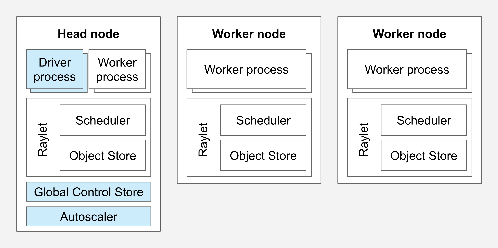
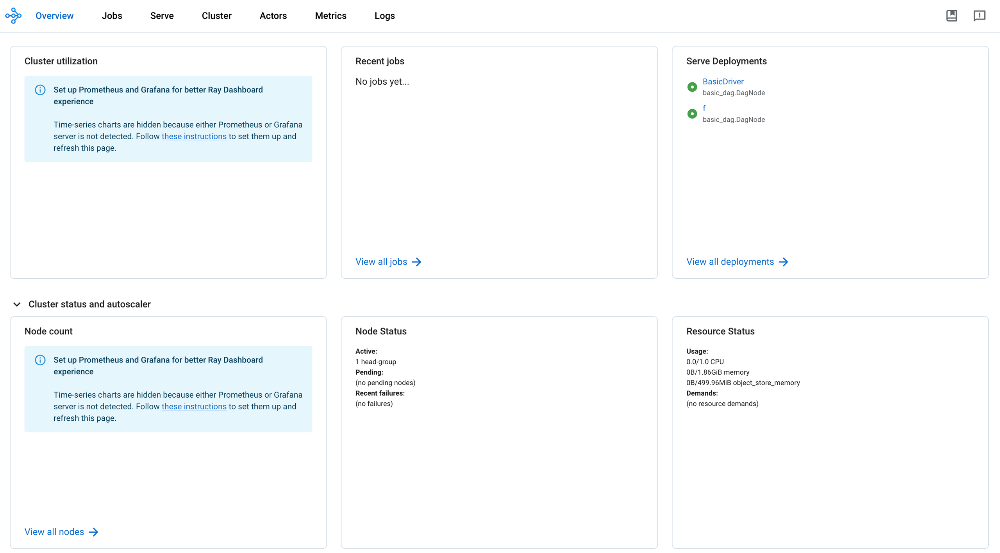

# Cheat Sheet - Ray

# Table of Contents (ToC)
- [Cheat Sheet - Ray](#cheat-sheet---ray)
- [Table of Contents (ToC)](#table-of-contents-toc)
  - [What is Ray?](#what-is-ray)
  - [Prerequisite](#prerequisite)
  - [Architecture \& key concepts](#architecture--key-concepts)
    - [Ray Cluster](#ray-cluster)
    - [Ray Service](#ray-service)
      - [Deployment](#deployment)
      - [Application](#application)
      - [Ingress Deployment](#ingress-deployment)
    - [Development workflow](#development-workflow)
      - [Local Development](#local-development)
      - [From Local to EKS](#from-local-to-eks)
    - [Commands](#commands)
      - [Ray Service](#ray-service-1)
      - [Serve Run](#serve-run)

## What is Ray?

Ray is a high-performance distributed computing framework designed to scale Python applications from a single machine to a large cluster effortlessly. It offers a simple API for parallelizing and distributing tasks, making it ideal for large-scale machine learning and AI workloads. Ray abstracts the complexity of distributed computing, enabling developers to focus on writing Python code without worrying about the underlying infrastructure. Ray integrates well with popular Python libraries and frameworks, such as Transformers, PyTorch, and TensorFlow.

## Prerequisite

- A custom trained model or an open source model.
- Access to the EKS GPU Cluster and a namespace inside. 
- Kubectl
- pyenv/python/pip

## Architecture & key concepts

### Ray Cluster

A ray cluster is a set of worker nodes connected to a common Ray Head Node. Ray nodes are pods in a kubernetes cluster. Ray clusters can be fixed-size, or the may autoscale up and down according to the ressources requested by applications running on the cluster. 



Ray head node
Every Ray cluster has one node which is designated as the head node of the cluster. The head node is identical to other worker nodes, except that it also runs singleton processes responsible for cluster management such as the autoscaler, GCS (Global Control Service) and the Ray dashboard.

Ray worker node
Worker nodes do not run any head node management processes, and serve only to run user code in Ray tasks and actors.

Ray dashboard
Ray provides a web-based dashboard for monitoring and debugging Ray applications. The visual representation of the system state, allows users to track the performance of applications and troubleshoot issues.



### Ray Service

#### Deployment
Deployments are the central concept in Ray Serve. A deployment contains business logic or an ML model to handle incoming requests and can be scaled up to run across a Ray cluster. At runtime, a deployment consists of a number of replicas, which are individual copies of the class or function that are started in separate Ray Actors (processes). The number of replicas can be scaled up or down (or even autoscaled) to match the incoming request load.

#### Application
An application is the unit of upgrade in a Ray Serve cluster. An application consists of one or more deployments. One of these deployments is considered the “ingress” deployment, which handles all inbound traffic.

#### Ingress Deployment
The ingress deployment defines the HTTP handling logic for the application. A Serve application can consist of multiple deployments that can be combined to perform model composition or complex business logic. However, one deployment is always the “top-level” one that is passed to serve.run to deploy the application. This deployment is called the “ingress” deployment because it serves as the entrypoint for all traffic to the application.

### Development workflow

#### Local Development
First of all you’ll want to start development on your own laptop.

**From python to ray**
We will first convert a classique python code into a ray serve application. Our exemple will be based on a text-translation model. This is the code base:

```python 
# File name: model.py
from transformers import pipeline
class Translator:
    def __init__(self):
        # Load model
        self.model = pipeline("translation_en_to_fr", model="t5-small")
    def translate(self, text: str) -> str:
        # Run inference
        model_output = self.model(text)
        # Post-process output to return only the translation text
        translation = model_output[0]["translation_text"]
        return translation
translator = Translator()
translation = translator.translate("Hello world!")
print(translation)
```

Install the transformer module  
```sh
pip install transformer
```

You can now test the code:
```sh
python model.py
Bonjour monde!
```

- NB: The translation model will be downloaded at runtime. If download is blocked by Zscaler please change your network.

Converting this model into a Ray Serve application with FastAPI requires three changes:

1. Import Ray Serve and Fast API dependencies
2. Add decorators for Serve deployment with FastAPI: `@serve.deployment` and `@serve.ingress(app)`
3. `bind` the `Translator` deployment to the arguments that are passed into its constructor

```python 
# File name: raymodel.py
import ray
from ray import serve
from fastapi import FastAPI
from transformers import pipeline
app = FastAPI()
@serve.deployment(num_replicas=2, ray_actor_options={"num_cpus": 0.2, "num_gpus": 0})
@serve.ingress(app)
class Translator:
    def __init__(self):
        # Load model
        self.model = pipeline("translation_en_to_fr", model="t5-small")
    @app.post("/")
    def translate(self, text: str) -> str:
        # Run inference
        model_output = self.model(text)
        # Post-process output to return only the translation text
        translation = model_output[0]["translation_text"]
        return translation
translator_app = Translator.bind()
```

Note that the code configures parameters for the deployment, such as `num_replicas` and `ray_actor_options`. These parameters help configure the number of copies of the deployment and the resource requirements for each copy. In this case, we set up 2 replicas of the model that take 0.2 CPUs and 0 GPUs each.

Install required modules and CLI:
```sh
pip install fastapi
pip install "ray[serve]"
```

To test locally, run the script with the serve run CLI command.
```sh
serve run raymodel:translator_app
```

This will create a serve worker on your local environment, create a ray dashboard (http://127.0.0.1:8265/) and expose the newly created api on port 8000 (http://127.0.0.1:8000)

We can now send http request directly to the app:
```python
# File name: model_client.py
import requests
response = requests.post("http://127.0.0.1:8000/", params={"text": "Hello world!"})
french_text = response.json()
print(french_text)
```

```sh
python model_client.py
# Bonjour monde!
```

You can exit the ray serve command using `ctrl+c`.


#### From Local to EKS

For certain projects, you will require a GPU to run your application, as your local environment may not suffice. On the dedicated EKS GPU cluster, you can deploy your Ray application using GPU nodes and expose your app on the local network.

### Commands
#### Ray Service

We create a Ray Service to host our development. 
```yaml
# File name: ray_service.yaml
apiVersion: ray.io/v1
kind: RayService
metadata:
  name: demo-raycluster
  namespace: demo
spec:
  serveConfigV2: |
    applications:
      - name: starter
        import_path: basic_dag.DagNode
        route_prefix: /starter
        runtime_env:
          working_dir: "https://github.com/ray-project/test_dag/archive/1a0ca74268de85affc6ead99121e2de7a01fa360.zip"
        deployments:
          - name: f
            ray_actor_options:
              num_cpus: 0.1
              num_gpus: 0
            autoscaling_config:
              min_replicas: 0
              max_replicas: 1
          - name: BasicDriver
            ray_actor_options:
                num_cpus: 0.1
                num_gpus: 0
            autoscaling_config:
              min_replicas: 0
              max_replicas: 1
  rayClusterConfig:
    enableInTreeAutoscaling: true
    autoscalerOptions:
      idleTimeoutSeconds: 120
    rayVersion: 2.24.0
    headGroupSpec:
      rayStartParams:
        dashboard-host: 0.0.0.0
        #num-cpus: "0"
      template:
        metadata: {}
        spec:
          containers:
            - image: 614303399241.dkr.ecr.eu-west-1.amazonaws.com/ray-ml:2.24.0
              name: ray-head
              ports:
                - containerPort: 6379
                  name: gcs
                  protocol: TCP
                - containerPort: 8265
                  name: dashboard
                  protocol: TCP
                - containerPort: 10001
                  name: client
                  protocol: TCP
                - containerPort: 8000
                  name: serve
                  protocol: TCP
                - containerPort: 44217
                  name: as-metrics # autoscaler
                - containerPort: 44227
                  name: dash-metrics # dashboard
              env: &env
              resources:
                limits:
                  cpu: "1"
                  memory: 2G
              volumeMounts: &volumeMounts
                - mountPath: /tmp/ray
                  name: ray-logs
          volumes: &volumes
            - emptyDir: {}
              name: ray-logs
    workerGroupSpecs:
      - groupName: gpu-group
        maxReplicas: 5
        minReplicas: 0
        rayStartParams: {}
        template:
          spec:
            containers:
              - image: 614303399241.dkr.ecr.eu-west-1.amazonaws.com/ray-ml:2.24.0-gpu
                name: ray-worker
                resources:
                  limits:
                    cpu: "1"
                    memory: 4G
                    nvidia.com/gpu: "1"
                  requests:
                    cpu: "1"
                    memory: 4G
                    nvidia.com/gpu: "1"
                env: *env
                volumeMounts: *volumeMounts
            securityContext:
              fsGroup: 100
            tolerations:
              - effect: NoSchedule
                key: nvidia.com/gpu
                operator: Equal
                value: "true"
            volumes: *volumes
      - replicas: 1
        minReplicas: 0
        maxReplicas: 5
        groupName: cpu-group
        rayStartParams: {}
        # Pod template
        template:
          spec:
            containers:
            - name: ray-worker
              image: 614303399241.dkr.ecr.eu-west-1.amazonaws.com/ray-ml:2.24.0-gpu
              resources:
                limits:
                  cpu: 1
                  memory: "4G"
              env: *env
              volumeMounts: *volumeMounts
            volumes: *volumes
```

```sh
kubectl apply -f ray_service.yaml
```

Deploy a Ray Cluster with a basic dummy app as a Ray application to keep the cluster operational. We establish a Ray head node along with two worker groups: one dedicated to GPU workloads and the other for all remaining tasks. The dashboard of this cluster is accessible through port-forward http://127.0.0.1:8265

```sh
kubectl port-forward -n demo service/demo-raycluster-head-svc 8265:8265 &
```

#### Serve Run

To deploy our application on the Ray Service, we must package it and then transfer it to the head node.

We first need to create an another port-forward to the Client port of the Ray Service:
```sh
kubectl port-forward -n demo service/demo-raycluster-head-svc 10001:10001 &
```

Then, the serve run command can be utilized again, this time with additional arguments.
```sh
serve run --address=ray://localhost:10001  --name="demo" --route-prefix="/" -r --working-dir="." raymodel:translator_app
```

In the Ray dashboard, your application should appear in the Serve section.

Some details: 
- `--working-dir` is where your application code is
- `-r` enable live reloading.When you save changes in your code, the application is automatically repackaged and transferred to the head node.
- `--route-prefix` set the prefix path of your http app

With a third port-forward you can send requests to your app:
```sh
kubectl port-forward -n demo service/demo-raycluster-serve-svc 8000:8000 &
python model_client.py
# Bonjour monde !
```

When you press ctrl+c, the server is shut down, and the created server (with or without GPU) is gradually deleted.
