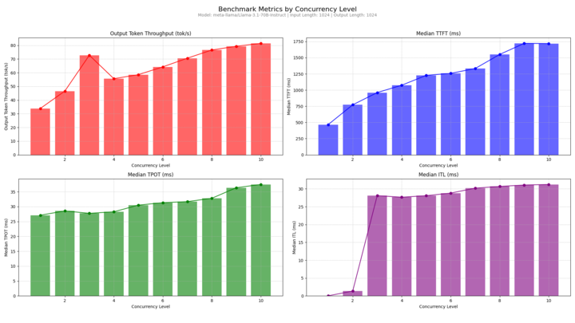

# References

## Events

ai-PULSE:
- Morning Keynotes: https://ow.ly/MQHP50U5299
- Master Stage: https://ow.ly/bt0f50U5298
- Central Room: https://ow.ly/6ljG50U5297

## Tests
Accès gratuit d'une version bêta (api generative AI). 

Tuto: 
- Créer un compte sur la console pour y accéder: https://www.scaleway.com/en/docs/console/account/how-to/create-an-account/
- Tester Generative APIs ici: https://console.scaleway.com/generative-api/models
- Consultezr le Guide d’utilisation ici: https://www.scaleway.com/en/docs/ai-data/generative-apis/quickstart/

## Benchmark managed inference (1xH100)

- Conditions:
  - 1 GPU H100
  - LLaMA 3.1-70B-Instruct et toujours avec 
  - 1024 tokens.

- Résultats:

- Notes:
    - **Output Token Throughput (graphique en rouge):** La vitesse de génération progresse régulièrement avec la concurrence, atteignant environ 45 tokens/seconde en pic.
    - **Median TTFT (graphique en bleu):** Le temps pour recevoir le premier token reste plus faible au début (environ 200 ms) et augmente graduellement jusqu'à 300 ms avec la charge.
    - **Median TPOT (graphique en vert):** Le temps par token reste très stable autour de 30-35 ms.
    - **Median ITL (graphique en violet):** La latence inter-token montre une légère hausse mais reste maîtrisée autour de 0.04 ms.