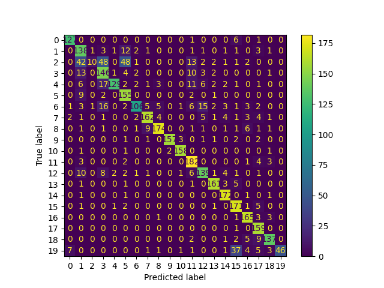

# Model description

[More Information Needed]

## Intended uses & limitations

[More Information Needed]

## Training Procedure

[More Information Needed]

### Hyperparameters

<details>
<summary> Click to expand </summary>

| Hyperparameter       | Value                                                    |
|----------------------|----------------------------------------------------------|
| memory               |                                                          |
| steps                | [('count', CountVectorizer()), ('clf', MultinomialNB())] |
| verbose              | False                                                    |
| count                | CountVectorizer()                                        |
| clf                  | MultinomialNB()                                          |
| count__analyzer      | word                                                     |
| count__binary        | False                                                    |
| count__decode_error  | strict                                                   |
| count__dtype         | <class 'numpy.int64'>                                    |
| count__encoding      | utf-8                                                    |
| count__input         | content                                                  |
| count__lowercase     | True                                                     |
| count__max_df        | 1.0                                                      |
| count__max_features  |                                                          |
| count__min_df        | 1                                                        |
| count__ngram_range   | (1, 1)                                                   |
| count__preprocessor  |                                                          |
| count__stop_words    |                                                          |
| count__strip_accents |                                                          |
| count__token_pattern | (?u)\b\w\w+\b                                            |
| count__tokenizer     |                                                          |
| count__vocabulary    |                                                          |
| clf__alpha           | 1.0                                                      |
| clf__class_prior     |                                                          |
| clf__fit_prior       | True                                                     |
| clf__force_alpha     | True                                                     |

</details>

### Model Plot

<style>#sk-container-id-2 {/* Definition of color scheme common for light and dark mode */--sklearn-color-text: black;--sklearn-color-line: gray;/* Definition of color scheme for unfitted estimators */--sklearn-color-unfitted-level-0: #fff5e6;--sklearn-color-unfitted-level-1: #f6e4d2;--sklearn-color-unfitted-level-2: #ffe0b3;--sklearn-color-unfitted-level-3: chocolate;/* Definition of color scheme for fitted estimators */--sklearn-color-fitted-level-0: #f0f8ff;--sklearn-color-fitted-level-1: #d4ebff;--sklearn-color-fitted-level-2: #b3dbfd;--sklearn-color-fitted-level-3: cornflowerblue;/* Specific color for light theme */--sklearn-color-text-on-default-background: var(--sg-text-color, var(--theme-code-foreground, var(--jp-content-font-color1, black)));--sklearn-color-background: var(--sg-background-color, var(--theme-background, var(--jp-layout-color0, white)));--sklearn-color-border-box: var(--sg-text-color, var(--theme-code-foreground, var(--jp-content-font-color1, black)));--sklearn-color-icon: #696969;@media (prefers-color-scheme: dark) {/* Redefinition of color scheme for dark theme */--sklearn-color-text-on-default-background: var(--sg-text-color, var(--theme-code-foreground, var(--jp-content-font-color1, white)));--sklearn-color-background: var(--sg-background-color, var(--theme-background, var(--jp-layout-color0, #111)));--sklearn-color-border-box: var(--sg-text-color, var(--theme-code-foreground, var(--jp-content-font-color1, white)));--sklearn-color-icon: #878787;}
}#sk-container-id-2 {color: var(--sklearn-color-text);
}#sk-container-id-2 pre {padding: 0;
}#sk-container-id-2 input.sk-hidden--visually {border: 0;clip: rect(1px 1px 1px 1px);clip: rect(1px, 1px, 1px, 1px);height: 1px;margin: -1px;overflow: hidden;padding: 0;position: absolute;width: 1px;
}#sk-container-id-2 div.sk-dashed-wrapped {border: 1px dashed var(--sklearn-color-line);margin: 0 0.4em 0.5em 0.4em;box-sizing: border-box;padding-bottom: 0.4em;background-color: var(--sklearn-color-background);
}#sk-container-id-2 div.sk-container {/* jupyter's `normalize.less` sets `[hidden] { display: none; }`but bootstrap.min.css set `[hidden] { display: none !important; }`so we also need the `!important` here to be able to override thedefault hidden behavior on the sphinx rendered scikit-learn.org.See: https://github.com/scikit-learn/scikit-learn/issues/21755 */display: inline-block !important;position: relative;
}#sk-container-id-2 div.sk-text-repr-fallback {display: none;
}div.sk-parallel-item,
div.sk-serial,
div.sk-item {/* draw centered vertical line to link estimators */background-image: linear-gradient(var(--sklearn-color-text-on-default-background), var(--sklearn-color-text-on-default-background));background-size: 2px 100%;background-repeat: no-repeat;background-position: center center;
}/* Parallel-specific style estimator block */#sk-container-id-2 div.sk-parallel-item::after {content: "";width: 100%;border-bottom: 2px solid var(--sklearn-color-text-on-default-background);flex-grow: 1;
}#sk-container-id-2 div.sk-parallel {display: flex;align-items: stretch;justify-content: center;background-color: var(--sklearn-color-background);position: relative;
}#sk-container-id-2 div.sk-parallel-item {display: flex;flex-direction: column;
}#sk-container-id-2 div.sk-parallel-item:first-child::after {align-self: flex-end;width: 50%;
}#sk-container-id-2 div.sk-parallel-item:last-child::after {align-self: flex-start;width: 50%;
}#sk-container-id-2 div.sk-parallel-item:only-child::after {width: 0;
}/* Serial-specific style estimator block */#sk-container-id-2 div.sk-serial {display: flex;flex-direction: column;align-items: center;background-color: var(--sklearn-color-background);padding-right: 1em;padding-left: 1em;
}/* Toggleable style: style used for estimator/Pipeline/ColumnTransformer box that is
clickable and can be expanded/collapsed.
- Pipeline and ColumnTransformer use this feature and define the default style
- Estimators will overwrite some part of the style using the `sk-estimator` class
*//* Pipeline and ColumnTransformer style (default) */#sk-container-id-2 div.sk-toggleable {/* Default theme specific background. It is overwritten whether we have aspecific estimator or a Pipeline/ColumnTransformer */background-color: var(--sklearn-color-background);
}/* Toggleable label */
#sk-container-id-2 label.sk-toggleable__label {cursor: pointer;display: block;width: 100%;margin-bottom: 0;padding: 0.5em;box-sizing: border-box;text-align: center;
}#sk-container-id-2 label.sk-toggleable__label-arrow:before {/* Arrow on the left of the label */content: "▸";float: left;margin-right: 0.25em;color: var(--sklearn-color-icon);
}#sk-container-id-2 label.sk-toggleable__label-arrow:hover:before {color: var(--sklearn-color-text);
}/* Toggleable content - dropdown */#sk-container-id-2 div.sk-toggleable__content {max-height: 0;max-width: 0;overflow: hidden;text-align: left;/* unfitted */background-color: var(--sklearn-color-unfitted-level-0);
}#sk-container-id-2 div.sk-toggleable__content.fitted {/* fitted */background-color: var(--sklearn-color-fitted-level-0);
}#sk-container-id-2 div.sk-toggleable__content pre {margin: 0.2em;border-radius: 0.25em;color: var(--sklearn-color-text);/* unfitted */background-color: var(--sklearn-color-unfitted-level-0);
}#sk-container-id-2 div.sk-toggleable__content.fitted pre {/* unfitted */background-color: var(--sklearn-color-fitted-level-0);
}#sk-container-id-2 input.sk-toggleable__control:checked~div.sk-toggleable__content {/* Expand drop-down */max-height: 200px;max-width: 100%;overflow: auto;
}#sk-container-id-2 input.sk-toggleable__control:checked~label.sk-toggleable__label-arrow:before {content: "▾";
}/* Pipeline/ColumnTransformer-specific style */#sk-container-id-2 div.sk-label input.sk-toggleable__control:checked~label.sk-toggleable__label {color: var(--sklearn-color-text);background-color: var(--sklearn-color-unfitted-level-2);
}#sk-container-id-2 div.sk-label.fitted input.sk-toggleable__control:checked~label.sk-toggleable__label {background-color: var(--sklearn-color-fitted-level-2);
}/* Estimator-specific style *//* Colorize estimator box */
#sk-container-id-2 div.sk-estimator input.sk-toggleable__control:checked~label.sk-toggleable__label {/* unfitted */background-color: var(--sklearn-color-unfitted-level-2);
}#sk-container-id-2 div.sk-estimator.fitted input.sk-toggleable__control:checked~label.sk-toggleable__label {/* fitted */background-color: var(--sklearn-color-fitted-level-2);
}#sk-container-id-2 div.sk-label label.sk-toggleable__label,
#sk-container-id-2 div.sk-label label {/* The background is the default theme color */color: var(--sklearn-color-text-on-default-background);
}/* On hover, darken the color of the background */
#sk-container-id-2 div.sk-label:hover label.sk-toggleable__label {color: var(--sklearn-color-text);background-color: var(--sklearn-color-unfitted-level-2);
}/* Label box, darken color on hover, fitted */
#sk-container-id-2 div.sk-label.fitted:hover label.sk-toggleable__label.fitted {color: var(--sklearn-color-text);background-color: var(--sklearn-color-fitted-level-2);
}/* Estimator label */#sk-container-id-2 div.sk-label label {font-family: monospace;font-weight: bold;display: inline-block;line-height: 1.2em;
}#sk-container-id-2 div.sk-label-container {text-align: center;
}/* Estimator-specific */
#sk-container-id-2 div.sk-estimator {font-family: monospace;border: 1px dotted var(--sklearn-color-border-box);border-radius: 0.25em;box-sizing: border-box;margin-bottom: 0.5em;/* unfitted */background-color: var(--sklearn-color-unfitted-level-0);
}#sk-container-id-2 div.sk-estimator.fitted {/* fitted */background-color: var(--sklearn-color-fitted-level-0);
}/* on hover */
#sk-container-id-2 div.sk-estimator:hover {/* unfitted */background-color: var(--sklearn-color-unfitted-level-2);
}#sk-container-id-2 div.sk-estimator.fitted:hover {/* fitted */background-color: var(--sklearn-color-fitted-level-2);
}/* Specification for estimator info (e.g. "i" and "?") *//* Common style for "i" and "?" */.sk-estimator-doc-link,
a:link.sk-estimator-doc-link,
a:visited.sk-estimator-doc-link {float: right;font-size: smaller;line-height: 1em;font-family: monospace;background-color: var(--sklearn-color-background);border-radius: 1em;height: 1em;width: 1em;text-decoration: none !important;margin-left: 1ex;/* unfitted */border: var(--sklearn-color-unfitted-level-1) 1pt solid;color: var(--sklearn-color-unfitted-level-1);
}.sk-estimator-doc-link.fitted,
a:link.sk-estimator-doc-link.fitted,
a:visited.sk-estimator-doc-link.fitted {/* fitted */border: var(--sklearn-color-fitted-level-1) 1pt solid;color: var(--sklearn-color-fitted-level-1);
}/* On hover */
div.sk-estimator:hover .sk-estimator-doc-link:hover,
.sk-estimator-doc-link:hover,
div.sk-label-container:hover .sk-estimator-doc-link:hover,
.sk-estimator-doc-link:hover {/* unfitted */background-color: var(--sklearn-color-unfitted-level-3);color: var(--sklearn-color-background);text-decoration: none;
}div.sk-estimator.fitted:hover .sk-estimator-doc-link.fitted:hover,
.sk-estimator-doc-link.fitted:hover,
div.sk-label-container:hover .sk-estimator-doc-link.fitted:hover,
.sk-estimator-doc-link.fitted:hover {/* fitted */background-color: var(--sklearn-color-fitted-level-3);color: var(--sklearn-color-background);text-decoration: none;
}/* Span, style for the box shown on hovering the info icon */
.sk-estimator-doc-link span {display: none;z-index: 9999;position: relative;font-weight: normal;right: .2ex;padding: .5ex;margin: .5ex;width: min-content;min-width: 20ex;max-width: 50ex;color: var(--sklearn-color-text);box-shadow: 2pt 2pt 4pt #999;/* unfitted */background: var(--sklearn-color-unfitted-level-0);border: .5pt solid var(--sklearn-color-unfitted-level-3);
}.sk-estimator-doc-link.fitted span {/* fitted */background: var(--sklearn-color-fitted-level-0);border: var(--sklearn-color-fitted-level-3);
}.sk-estimator-doc-link:hover span {display: block;
}/* "?"-specific style due to the `<a>` HTML tag */#sk-container-id-2 a.estimator_doc_link {float: right;font-size: 1rem;line-height: 1em;font-family: monospace;background-color: var(--sklearn-color-background);border-radius: 1rem;height: 1rem;width: 1rem;text-decoration: none;/* unfitted */color: var(--sklearn-color-unfitted-level-1);border: var(--sklearn-color-unfitted-level-1) 1pt solid;
}#sk-container-id-2 a.estimator_doc_link.fitted {/* fitted */border: var(--sklearn-color-fitted-level-1) 1pt solid;color: var(--sklearn-color-fitted-level-1);
}/* On hover */
#sk-container-id-2 a.estimator_doc_link:hover {/* unfitted */background-color: var(--sklearn-color-unfitted-level-3);color: var(--sklearn-color-background);text-decoration: none;
}#sk-container-id-2 a.estimator_doc_link.fitted:hover {/* fitted */background-color: var(--sklearn-color-fitted-level-3);
}
</style><div id="sk-container-id-2" class="sk-top-container" style="overflow: auto;"><div class="sk-text-repr-fallback"><pre>Pipeline(steps=[(&#x27;count&#x27;, CountVectorizer()), (&#x27;clf&#x27;, MultinomialNB())])</pre><b>In a Jupyter environment, please rerun this cell to show the HTML representation or trust the notebook. <br />On GitHub, the HTML representation is unable to render, please try loading this page with nbviewer.org.</b></div><div class="sk-container" hidden><div class="sk-item sk-dashed-wrapped"><div class="sk-label-container"><div class="sk-label fitted sk-toggleable"><input class="sk-toggleable__control sk-hidden--visually" id="sk-estimator-id-4" type="checkbox" ><label for="sk-estimator-id-4" class="sk-toggleable__label fitted sk-toggleable__label-arrow fitted">&nbsp;&nbsp;Pipeline<a class="sk-estimator-doc-link fitted" rel="noreferrer" target="_blank" href="https://scikit-learn.org/1.4/modules/generated/sklearn.pipeline.Pipeline.html">?<span>Documentation for Pipeline</span></a><span class="sk-estimator-doc-link fitted">i<span>Fitted</span></span></label><div class="sk-toggleable__content fitted"><pre>Pipeline(steps=[(&#x27;count&#x27;, CountVectorizer()), (&#x27;clf&#x27;, MultinomialNB())])</pre></div> </div></div><div class="sk-serial"><div class="sk-item"><div class="sk-estimator fitted sk-toggleable"><input class="sk-toggleable__control sk-hidden--visually" id="sk-estimator-id-5" type="checkbox" ><label for="sk-estimator-id-5" class="sk-toggleable__label fitted sk-toggleable__label-arrow fitted">&nbsp;CountVectorizer<a class="sk-estimator-doc-link fitted" rel="noreferrer" target="_blank" href="https://scikit-learn.org/1.4/modules/generated/sklearn.feature_extraction.text.CountVectorizer.html">?<span>Documentation for CountVectorizer</span></a></label><div class="sk-toggleable__content fitted"><pre>CountVectorizer()</pre></div> </div></div><div class="sk-item"><div class="sk-estimator fitted sk-toggleable"><input class="sk-toggleable__control sk-hidden--visually" id="sk-estimator-id-6" type="checkbox" ><label for="sk-estimator-id-6" class="sk-toggleable__label fitted sk-toggleable__label-arrow fitted">&nbsp;MultinomialNB<a class="sk-estimator-doc-link fitted" rel="noreferrer" target="_blank" href="https://scikit-learn.org/1.4/modules/generated/sklearn.naive_bayes.MultinomialNB.html">?<span>Documentation for MultinomialNB</span></a></label><div class="sk-toggleable__content fitted"><pre>MultinomialNB()</pre></div> </div></div></div></div></div></div>

## Evaluation Results

| Metric   |    Value |
|----------|----------|
| accuracy | 0.822975 |
| f1 score | 0.822975 |

# How to Get Started with the Model

[More Information Needed]

# Model Card Authors

This model card is written by following authors:

[More Information Needed]

# Model Card Contact

You can contact the model card authors through following channels:
[More Information Needed]

# Citation

Below you can find information related to citation.

**BibTeX:**
```
[More Information Needed]
```

# citation_bibtex

bibtex
@inproceedings{...,year={2020}}

# get_started_code

import pickle
with open(pkl_filename, 'rb') as file:
    clf = pickle.load(file)

# model_card_authors

skops_user

# limitations

This model is not ready to be used in production.

# model_description

This is a Multinomial Naive Bayes model trained on 20 news groups dataset.Count vectorizer is used for vectorization.

# eval_method

The model is evaluated on validation data from 20 news group's test split, using accuracy and F1-score with micro average.

# Confusion matrix



# Classification Report

<details>
<summary> Click to expand </summary>

| index                    |   precision |    recall |   f1-score |   support |
|--------------------------|-------------|-----------|------------|-----------|
| alt.atheism              |    0.927007 | 0.940741  |   0.933824 |       135 |
| comp.graphics            |    0.6      | 0.831325  |   0.69697  |       166 |
| comp.os.ms-windows.misc  |    0.833333 | 0.0588235 |   0.10989  |       170 |
| comp.sys.ibm.pc.hardware |    0.603306 | 0.802198  |   0.688679 |       182 |
| comp.sys.mac.hardware    |    0.962687 | 0.704918  |   0.81388  |       183 |
| comp.windows.x           |    0.665236 | 0.91716   |   0.771144 |       169 |
| misc.forsale             |    0.905983 | 0.616279  |   0.733564 |       172 |
| rec.autos                |    0.895028 | 0.848168  |   0.870968 |       191 |
| rec.motorcycles          |    0.925532 | 0.878788  |   0.901554 |       198 |
| rec.sport.baseball       |    0.987421 | 0.934524  |   0.960245 |       168 |
| rec.sport.hockey         |    0.963415 | 0.969325  |   0.966361 |       163 |
| sci.crypt                |    0.767932 | 0.933333  |   0.842593 |       195 |
| sci.electronics          |    0.803468 | 0.785311  |   0.794286 |       177 |
| sci.med                  |    0.925287 | 0.936047  |   0.930636 |       172 |
| sci.space                |    0.891192 | 0.977273  |   0.932249 |       176 |
| soc.religion.christian   |    0.737069 | 0.93956   |   0.826087 |       182 |
| talk.politics.guns       |    0.863874 | 0.953757  |   0.906593 |       173 |
| talk.politics.mideast    |    0.795    | 0.99375   |   0.883333 |       160 |
| talk.politics.misc       |    0.901316 | 0.878205  |   0.88961  |       156 |
| talk.religion.misc       |    1        | 0.429907  |   0.601307 |       107 |
| macro avg                |    0.847704 | 0.81647   |   0.802689 |      3395 |
| weighted avg             |    0.843632 | 0.822975  |   0.805774 |      3395 |

</details>
